# **bigSCale 2**

*bigSCale* is a complete framework for the analysis and visualization of single cell data. It allows to cluster, phenotype, perform pseudotime analysis, infer gene regulatory networks and reduce large datasets in smaller datasets with higher quality.


**Why using bigSCale 2?**

*  *bigSCale2* features the most sensitive and accurate marker detection and classification. No method is used to reduce dimensions, every bit of information is retained.
*  *bigSCale2* allows to infer the gene regulatory networks for any single cell dataset.
*  *bigSCale2* allows to compress large datasets of any size into a smaller datasets of higher quality, without loss of information. One millions cells are too many to be analyzed by your favourite tool ? Reduce them to a dataset with less cells of increased quality and go for it!

**Quick Start**

*bigSCale* is formed by three sub-tools which can be used either independently or in synergy. Each sub-tool has its own tutorial.<br />
*bigSCale 2 Core* allows to cluster, phenotype and perform pseudo-time analysis. It's the main tool of bigSCale, published in [Iacono 2018](https://genome.cshlp.org/content/28/6/878).<br />
*bigSCale 2 GRN* is the newest addition: it is the module to infer gene regulatory networks from single cell data. [Iacono 2019](https://www.biorxiv.org/content/10.1101/446104v1)<br />
*bigSCale 2 iCells* allows to reduce the dimension of any given large dataset (also millions of cells, without any loss of information) so that it can be easily and quickly analyzed by any tool.The resulting dataset has less cells with higher quality, so it can be analyzed better. It DOES NOT require any external tool such as the loom framework. <br />
For help or questions contact me at **gio.iacono.work@gmail.com**


### **bigSCale 2 Core (clustering, phenotyping, pseudotime)**

* [Quick start and basic usage](#bigscale-2-core) 
    + [Running bigSCale](#running-the-analysis)
    + [Visualizing results](#visualizing-the-results)
        - [Clusters and  signatures of co-expressed genes](#visualizing-the-results)
        - [Markers of specific clusters](#markers-of-specific-clusters)
        - [Barplot of selected genes](#barplot-of-selected-genes)
        - [Violin plot of a selected gene](#violin-plot-of-a-selected-gene)
        - [t-SNE and UMAP plots](#t-sne-and-umap-plots)
        - [Browsing markers](#browsing-markers)
        - [Browsing signatures](#browsing-signatures)
        - [Pseudotime](#pseudotime)
        - [SuperClustering](#super-clustering)
* [Advanced use](#advanced-use)
    

### **bigSCale 2 Gene Regulatory Networks**

* [Quick start](#bigscale-2-gene-regulatory-networks-tutorial)
    + [Inferring the networks](#inferring-the-networks)
    + [Comparing node centrality](#comparing-node-centrality)
    + [Integration with DE](#integration-with-DE)
    + [Inversions of correlations](#inversions-of-correlations)
    + [Visualizing the networks](#visualizing-the-networks)
    + [Tweaking the networks](#tweaking-the-networks)

    

### **bigSCale 2 iCells for big Datasets**

* [Quick start](#bigscale-2-icells)


# **bigSCale 2 Core**

### **Running the analysis**

**READ BEFORE STARTING** *bigSCale2* is a special tool designed to have **maximum accuracy** in clustering and detection of markers. *bigSCale2* achieves extreme accuracy also because it does not use any dimensionality reduction. **If you have a large number of cells and you want to cluster/phenotype it with *bigSCale2 Core*, then first process it with the tool bigSCale2 iCells.** As a rule of thumb, you can analyze directly (without process with iCells) up to 20K cells if you have 16 Gb of RAM or up to 40K cells if you have 32b of RAM.

<br />

*bigSCale2* works with the SingleCellExperiment class. This class is a container meant to store in an organized way single cell data.
*bigScale2* requires two elements to be present in the single cell class: the counts `counts()` and the gene names `rownames()`.
**The counts must be raw counts! The genes must no be filtered, aside from removing, if you want, the gene with all zero values.**
<br />
Let us first load an example dataset : 3005 single cells from adult mouse brain [Zeisel 2015](http://science.sciencemag.org/content/347/6226/1138.abstract)


```{r}
data(sce)
``` 


As you can see, the `sce` object contains the expression values for 19972 genes in 3005 cells. **In its most basic use, bigScale is run with just one command `sce=bigscale(sce)` which will automatically perform all the analysis**. However, for time reasons, we will instruct *bigSCale2* to perform a quick analysis to save us time, by specifying `speed.preset='fast'`, which greatly reduces the the time required to compute  markers and differentially expressed genes, but at the expenses of the quality and accuracy (uses only wilcoxon test). In a real analysis we reccomand **not to use** this setting, and achieve maximum accuracy leaving as default `speed.preset='slow'` (leaving `speed.preset='fast'` works well when you have lots of cells, say>15K or 20K). 

```{r}
sce=bigscale(sce,speed.preset='fast') 
``` 

The analysis are now all complete and stored again in the `sce` object. In the next part we'll see how to visualize the results.


### **Visualizing the results**

### Clusters and  signatures of co-expressed genes

*bigSCale2* feature a basic set of plot types to visualize the main results of clustering and phenotyping.<br />
First, we make a plot of the clusters and signatures of coexpressed genes.


```{r}
viewSignatures(sce)
```

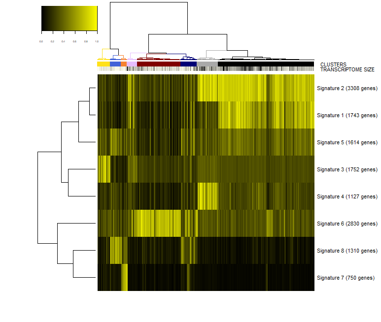

In this plot you can see

+ The dendrogram representing how the cells are phenotypically organized and clustered
+ Colored bars representing the clusters, the library size (meant as a proxy to transcriptome size/complexity) and the pseudotime of the cells. An additional color bar is displayed for any user custom `colData()` (for example, sample batches, conditions and so on ...). For custom user `colData`, the color codes are automatically chosen upoen the type of data (numeric or factor). 
+ The clustered signatures of coexpressed genes alogside their size. Here, all the genes differentially expressed are organized in signatures of co-expressed genes.


### Markers of specific clusters


Next, we would like to inspect the markers of a specific cluster, let's say cluster 2. To this end, we run.

```{r}
viewSignatures(sce,selected.cluster=2) 

``` 
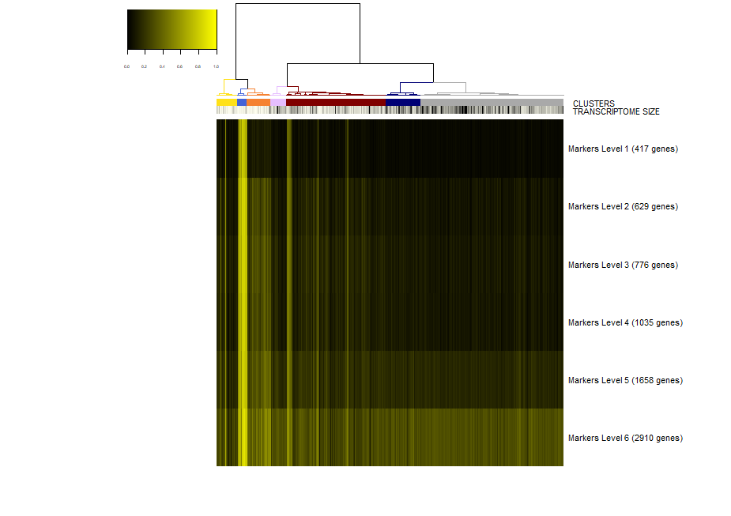

Now, the plot is the same as before, but in place of the signatures of coexpressed genes we see the markers of cluster 2 stratified by level of specificity. 
If you read my paper [Iacono 2018](https://genome.cshlp.org/content/28/6/878) then you'll know what this means.
Shortly, markers of level 1 are the most specific to a given cluster. Level 1 means that this 417 genes are expressed only in cluster 2 . However, shared markers are also very important in biology. Think to all the markers shared by neuronal cell types as opposed to glial cell types. Shared genes are represented in biSCale by markers of increasing levels.  Markers of level 2 (629 genes) are markers shared between cluster 2 and at most another cluster. Markers of level 3 are shared shared between cluster 2 and at most two other clusters, and so on. These markers of higher levels are typically lost by other computational tools.


### Barplot of selected genes

To plot gene expression at single cell level with colored clusters. This plot works well in synergy with the plot of the hierachical clustering.

```{r}
viewGeneBarPlot(sce,gene.list = c('Aqp4','Olig1','Thy1'))
``` 
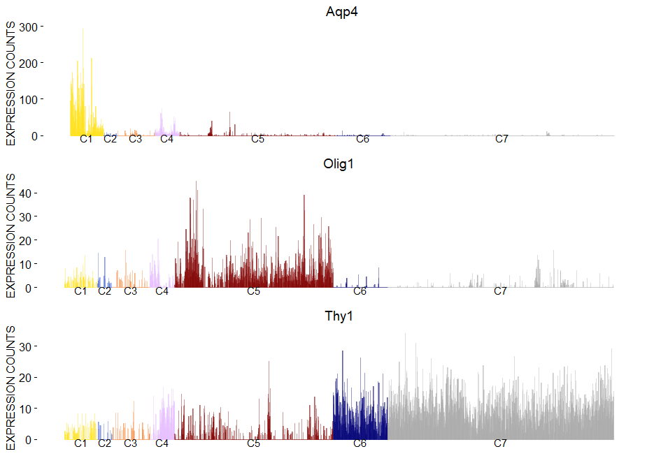

### Violin plot of a selected gene

```{r}
viewGeneViolin(sce,'Aqp4')
``` 
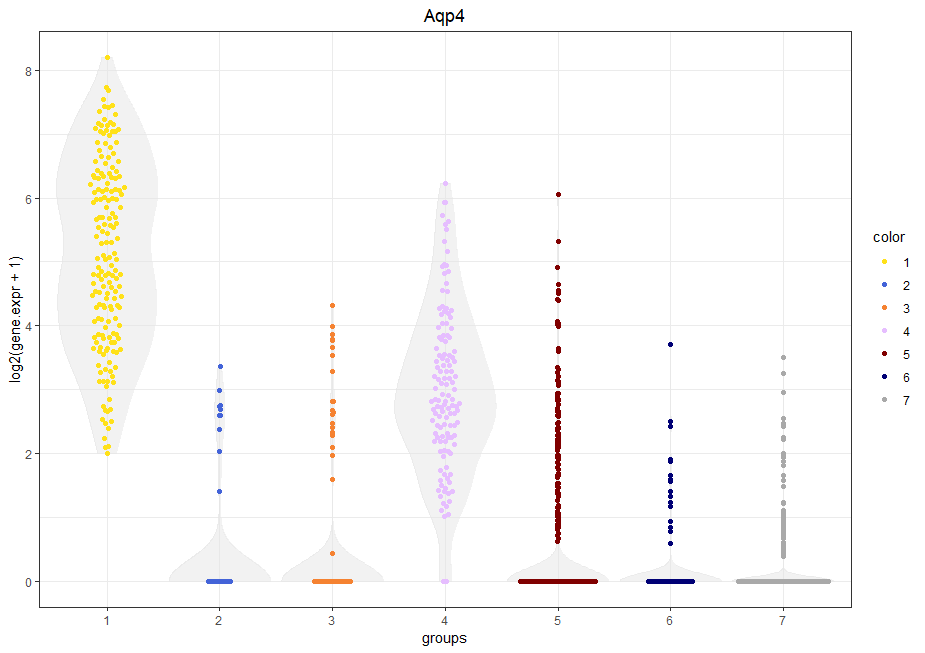

### t-SNE and UMAP plots

```{r}
viewReduced(sce) # to see t-SNE with clusters
``` 
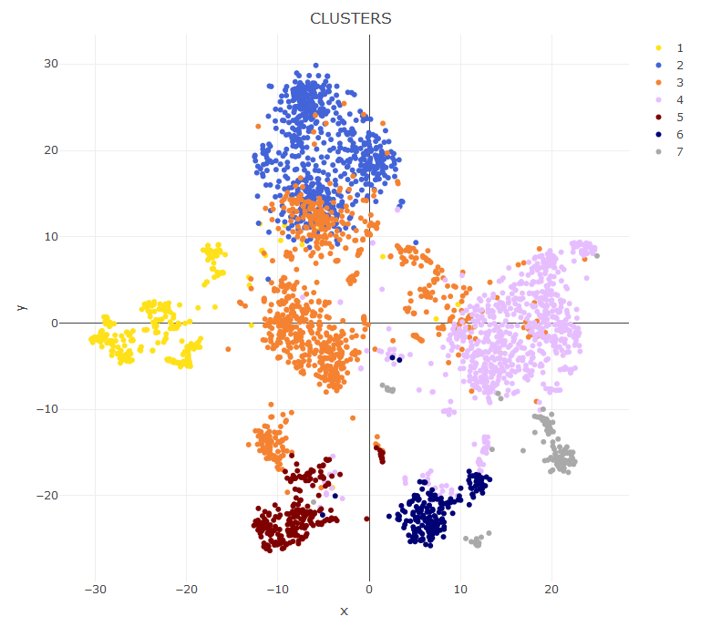

```{r}
viewReduced(sce,color.by = 'Stmn2') # to see t-SNE with gene expression
``` 
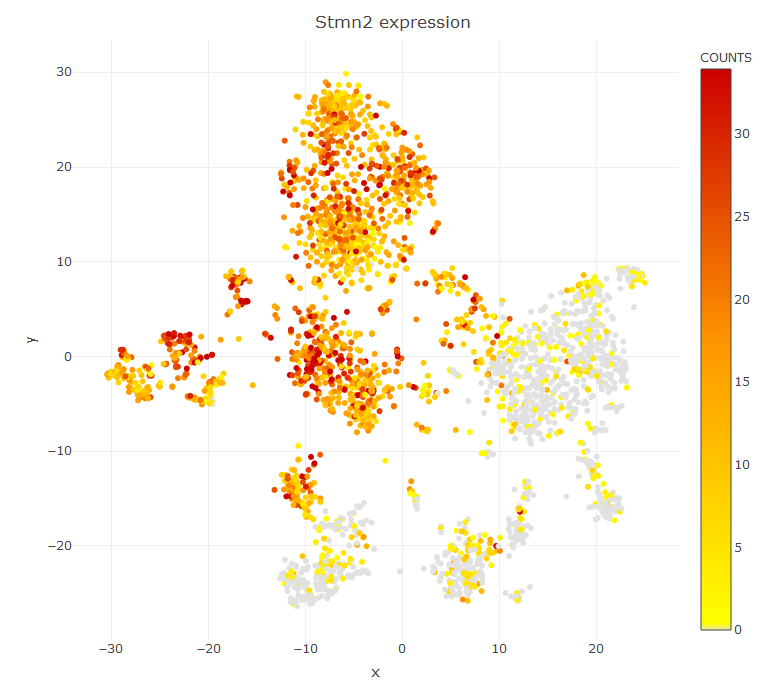


If you want to color the cell according to some custom annotation you pass a `factor` variable in place of a gene name. If you want to visualize a UMAP plot first compute the UMAP data with `sce=storeUMAP(sce)` and then `viewReduced(sce,method = 'UMAP')`

### Browsing markers

To have a look to the markers found by bigscale we retrive `Mlist` from the single cell object. `Mlist` is a 2 dimensional list containing for each cluster the markers of the different levels. Let's inspect the markers of level 1 (most specific) of cluster 4 (oligodendrocytes). We will take advantage of the package `DT` for interactive visualization.
Running the next command line we will see the markers specific to cluster 4 sorted from the highest (most significant) to the lowest (less significant) Zscore.


```{r}
Mlist=getMarkers(sce)
DT::datatable(Mlist[[4,1]])
``` 
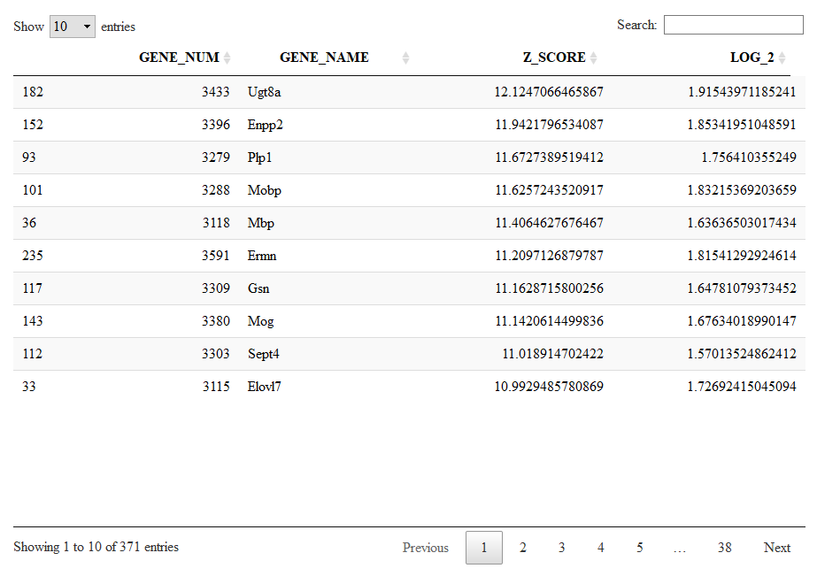


Let us now check other genes marking oligodendrocytes (cluster 5) which are shared with other clusters. We check markers of level 5 to include genes shared with at most 4 other clusters.


```{r}
DT::datatable(Mlist[[4,5]])
``` 

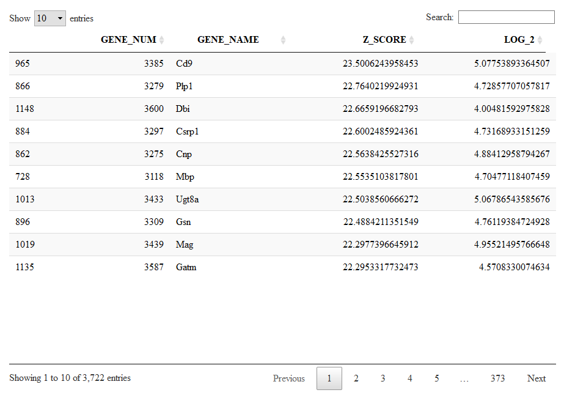


Here we can browse for Cd9, which has now a significant Z-score. Cd9 is a surface receptor expressed in oligodendrocytes but also in all the other glial cells.

### Browsing signatures

Alternatevely to a cluster-based organization of the markers (as shown before, we have clusters and we have levels) there is also a more compact organization of markers into lists of co-expressed genes. This are the same lists shown with `viewSignatures(sce)`.
Let us give a look to signature 1, a large list of 5432 genes expressed in neurons.

```{r}
Signatures=getSignatures(sce)
DT::datatable(Signatures[[1]])
```
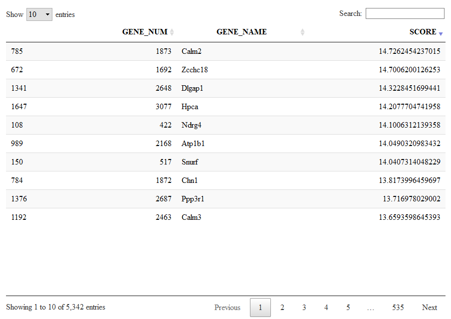

 **Keep in mind that we calculated these markers and signatures with the `speed.preset='fast'` which means low quality. This plots nd tables are for demonstration purposes only.**

### Pseudotime

*bigSCale2* can infer pseudotime and plot differentiation trajectories. By default, the flag `pseudotime=TRUE` tells bigSCale to compute psudotime. 
It does not make much biological sense to compute pseudtime of fully differentiated brain cells but this is just a technical demonstration. To view the results of the pseudotime we run:

```{r}
ViewPseudo(sce,color.by = 'pseudo') # colors by pseudotime
```

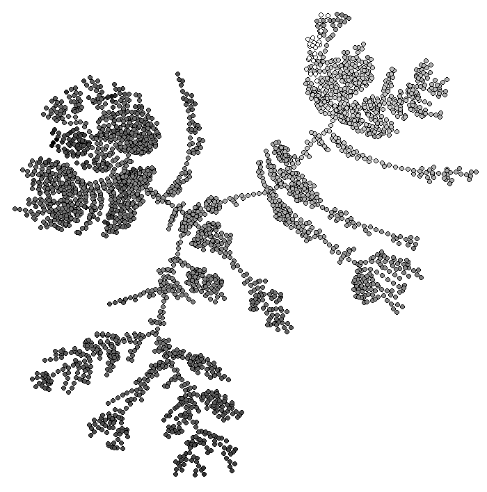

```{r}
ViewPseudo(sce,color.by = 'clusters') # colors by clusters
```

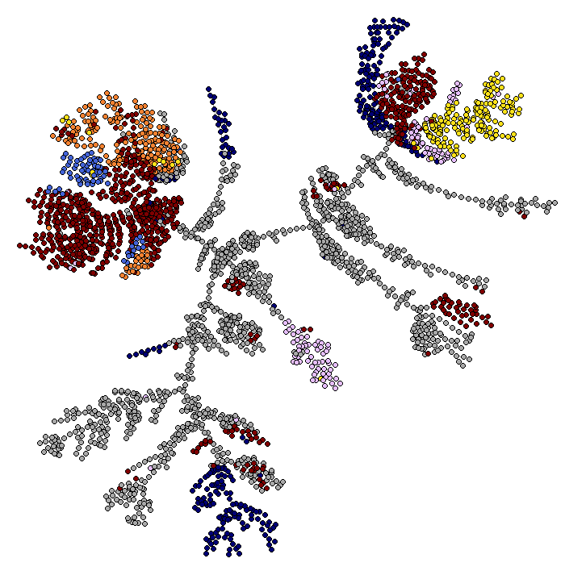

```{r}
ViewPseudo(sce,color.by = 'Stmn3') # colors by a specific gene
```
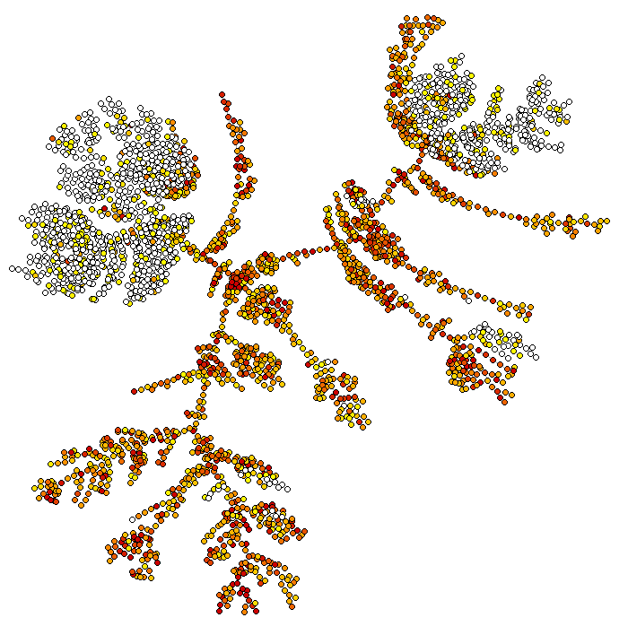

### Super Clustering

Super Clustering is a highly accurate recursive clustering which directly individautes the sub-types of a  dataset.
It can be activated by using the option `clustering='recursive'` when running bigSCale.

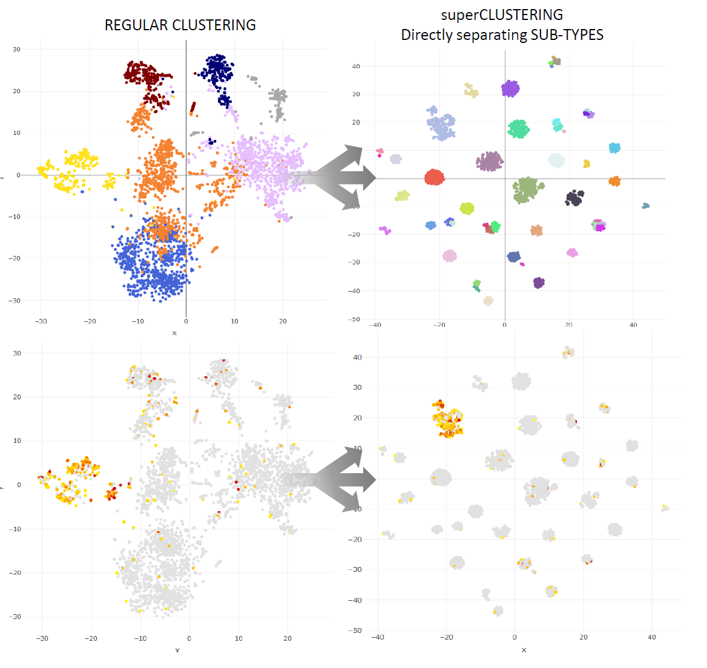

### **Advanced use**
The `bigscale()` function which performs all the analysis at once is actually a wrapper for a series of sub-functions.
Here we see how to run each part of the analysis separatly, to customize the pipeline.
We start again from the same dataset of the basic tutorial.

```{r}
data(sce)
``` 

Now, the first step is to pre-process the dataset. This step removes null genes and creates a number of internal variables needed by *bigSCale2*. In the future I will add the possibility here to specify a custom library size.

```{r}
sce=preProcess(sce)
``` 

Next three passages are non customizable (at least for the moment), we run them at once: 

```{r}
sce = storeNormalized(sce) # stores normalized data
sce=setModel(sce) # computes the numerical model
sce = storeTransformed(sce) # stores transformed expression data (needed for some plots)
``` 

A very important thing is to check that the numerical model of *bigSCale2* is not completley messed up. In my experience it is a rare case but can happen.
To check the computed model we run:

```{r}
viewModel(sce)
```
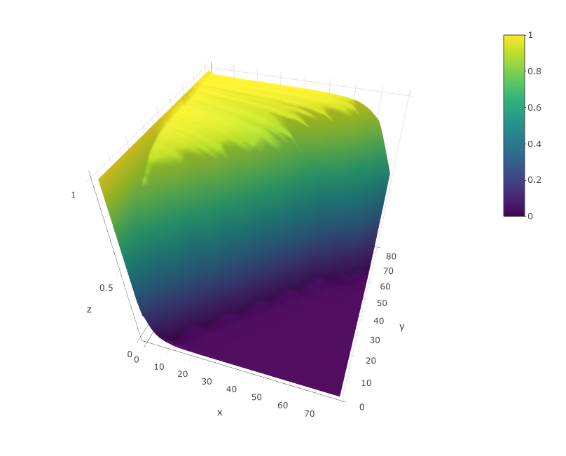

The model should look similar to the upper figure: a kind of sigmoidal surface decreasing more or less steeply in the diagonal. The sharper the decrese of the surface along the diagonal, the better the quality of the dataset. If the plot is very different from this one contact me. I will probably add in the close future an automated quality check of the model.


Now we compute the highly variable genes and we calculate cell to cell distances.
`min_ODscore` is the Z-score treshold for selecting the genes (default 2.33). Increase it to be more stringent (less genes) and viceversa. It is also possible to exclude specific intervals of expression from highly variable genes (parameter `use.exp`m check documentation of `setODgenes`). For example, exclude highly expressed genes (e.g. Ribosomal, Mitochondrial) from being selected.


```{r}
sce = setODgenes(sce,min_ODscore=2.33) 
``` 

You can visually inspect the selected highly variable genes with: 

```{r}
viewODgenes(sce)
``` 
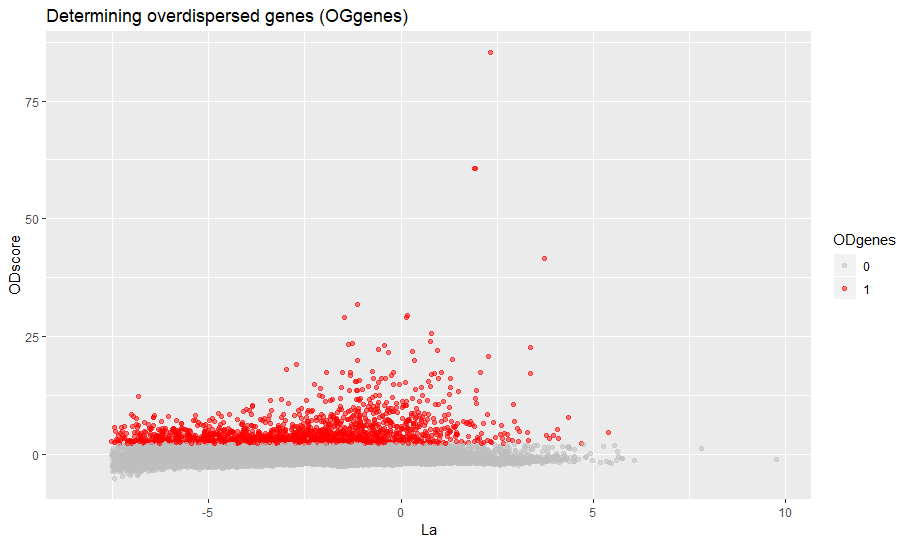

Next we compute the distances, nothing to customize here.

```{r}
sce=setDistances(sce)
```

We compute and store the TSNE data, if you want to see TSNE plots of course. Otherwise skip.

```{r}
sce=storeTsne(sce)
``` 

Now we cluster the data. Here you can make a couple of customizations to vary the number of clusters or even providing your own clusters. Check the help of the `setClusters` to see how to do.

```{r}
sce=setClusters(sce)
``` 

If you want to make also pseuotime analysis then run:

```{r}
sce=storePseudo(sce)
``` 
With the next command we compute the differential expression for all genes. This is generally the slowest part of the analysis. You can trade speed versus accuracy by changing the parameter `speed.preset`. I reccomand `speed.preset='slow'`, which is maximum accuracy with long computational time. I already discussed this parameter in the basic introduction.

```{r}
sce=computeMarkers(sce,speed.preset='slow')
```

Now we organize all the genes into markers and signatures of co-expression. `cutoff` is a Z-score which filters the genes and retains nly thosw with significant changes of expression. Inrease it if you want to be more stringent or viceversa.

```{r}
sce=setMarkers(sce,cutoff=3)
```

Finally, we restore some matrices from the virtual memory and we have competed our analysis.

```{r}
sce=restoreData(sce)
```


# bigSCale 2 Gene Regulatory Networks tutorial

**Important:** This short tutorial will show how to infer regulatory networks from single cell data and quantify gene centrality (and some other stuff). Clearly, graph theory is a large word, and there are lots of analysis other than node centrality that you can potentially perform on the networks. We leave this up to you!


###  Inferring the networks

*bigSCale2* allows to infer the putative gene regulatory network (GRN) from any single cell dataset. Here, we will show how to infer the GRNs from healthy pancreas and from type 2 diabetes (T2D) pancreas and compare them. This is the same pancreas dataset used in our [paper](https://www.biorxiv.org/content/10.1101/446104v1), from [Segerstolpe 2016](https://www.ncbi.nlm.nih.gov/pmc/articles/PMC5069352/). Let's load the data.

```{r}
data("pancreas")
```
Now we have in our sesssion two matrices with the expression counts for healthy (1313) and T2D (1178) cells, `expr.ctl` and `expr.t2d`, and the gene names `gene.names`. This is all we need to infer the networks. **Please note that for the moment *bigSCale2* supports only *Gene Symbols* or *Ensembl*, Mouse and Human**. Contact me if you want that I add other species or nomenclatures.<br />
<br />
There is only one parameter that you will change when doing a basic use of our tool. The parameter is `clustering` and it works as tradoff between accuracy and time. To put it simply:<br />

`clustering='recursive'` Is the default. Maximum accuracy, maximum time. If you are okay with leaving overnight then run it.
`clustering='direct'` Good accuracy, mimimum time. The fastest way to have results, if you are in a hurry.

As in the tutorial we are in a hurry we will do:

```{r}
results.ctl=compute.network(expr.data = expr.ctl,gene.names = gene.names,clustering = 'direct')
results.t2d=compute.network(expr.data = expr.t2d,gene.names = gene.names,clustering = 'direct')
```

The output of `compute.network()` is a list with a series of useful elements. I will not discuss here all the elements, I added a clear explanation about them in the help of the function `compute.network()`.
Let's have a look to the networks.

```{r}
results.ctl$graph
```
```{r}
IGRAPH f4962c7 UN-- 8887 89936 -- 
+ attr: name (v/c)
+ edges from f4962c7 (vertex names):
 [1] CLIC4 --RARB     CLIC4 --ABLIM3   CLIC4 --QKI     
 [4] CLIC4 --MDFI     CLIC4 --EPHX2    CLIC4 --MSL3    
 [7] CLIC4 --HNRNPF   CLIC4 --FOSL1    CLIC4 --CARD16  
[10] CLIC4 --ELK3     CLIC4 --THBS1    CLIC4 --YWHAB   
[13] AGBL4 --PEG3     NECAP2--LMNA     NECAP2--SF3B4   
[16] NECAP2--ARID5A   NECAP2--BAK1     NECAP2--ACTB    
[19] NECAP2--TBRG4    NECAP2--ILK      NECAP2--RFXANK  
[22] NECAP2--MAFF     TGFBR3--SIX2     TGFBR3--KIAA1211
+ ... omitted several edges
```

```{r}
results.t2d$graph
```

```{r}
IGRAPH ad2e341 UN-- 9407 97496 -- 
+ attr: name (v/c)
+ edges from ad2e341 (vertex names):
 [1] CLIC4--IFI16   CLIC4--CYR61   CLIC4--PHGDH   CLIC4--CELF3  
 [5] CLIC4--FHL2    CLIC4--ACTR3   CLIC4--CSRNP3  CLIC4--FN1    
 [9] CLIC4--SP100   CLIC4--EIF4E2  CLIC4--CYP1B1  CLIC4--INSIG2 
[13] CLIC4--RAF1    CLIC4--CTNNB1  CLIC4--FSTL1   CLIC4--REST   
[17] CLIC4--ENC1    CLIC4--DIMT1   CLIC4--NFYA    CLIC4--SYNCRIP
[21] CLIC4--RFX6    CLIC4--CHCHD3  CLIC4--CBX3    CLIC4--CAV1   
[25] CLIC4--MTDH    CLIC4--CLU     CLIC4--MSL3    CLIC4--MSN    
[29] CLIC4--HMGN5   CLIC4--BEX1    CLIC4--MOSPD1  CLIC4--LMO1   
+ ... omitted several edges
```

We have succesfully generated the networks. Control network has 8887 nodes (genes) and 89936 edges. T2D network has 9407 nodes and 97496 edges. Please remember that we generated these networks using the fastest option. When dealing with datasets so small it would be much  better to use `clustering='recursive'`.

### Comparing node centrality

*bigSCale2* has already calculated the gene (node) centralities and stored them in the output list. Centralities are a measure of the importance of a gene in the regulatory netowork. You should read our [paper](https://www.biorxiv.org/content/10.1101/446104v1) to know more. Let us give a look to the most central genes in the T2D network.

```{r}
DT::datatable(results.t2d$centrality)
```
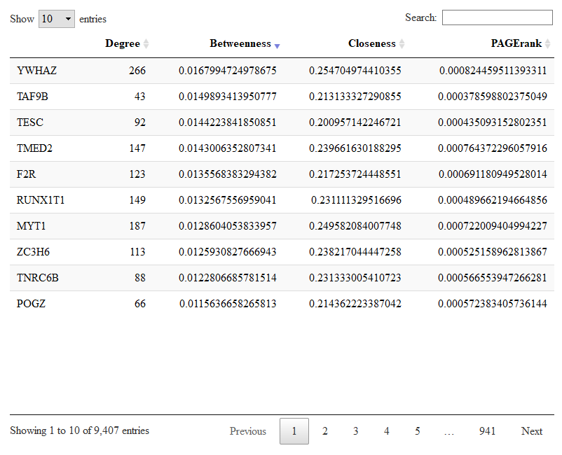

Here you have the table with the four centralities for each gene. You can sort each centrality to have a look to the most central genes. In the picture we sorted the betweenness. Genes with high betweenness are important imformation bottlenecks.

To compare changes in node centralities from control to T2D networks we run.

```{r}
comparison=compare.centrality(list(results.ctl$centrality,results.t2d$centrality),c('Control','TD2'))
```


The input of `compare.centrality()` is a list whose elements are the previously calculated centralities. We also provide the complete names of the conditions which will be used to annotate the output. The output of `compare.centrality()` is a list of data.frames. Each data.frame stores the genes ranked for their change in one given centrality (degree, betweenness, closeness, pagerank in order).
Let us check the genes with changes in betweenness.

```{r}
DT::datatable(comparison$betweenness)
```

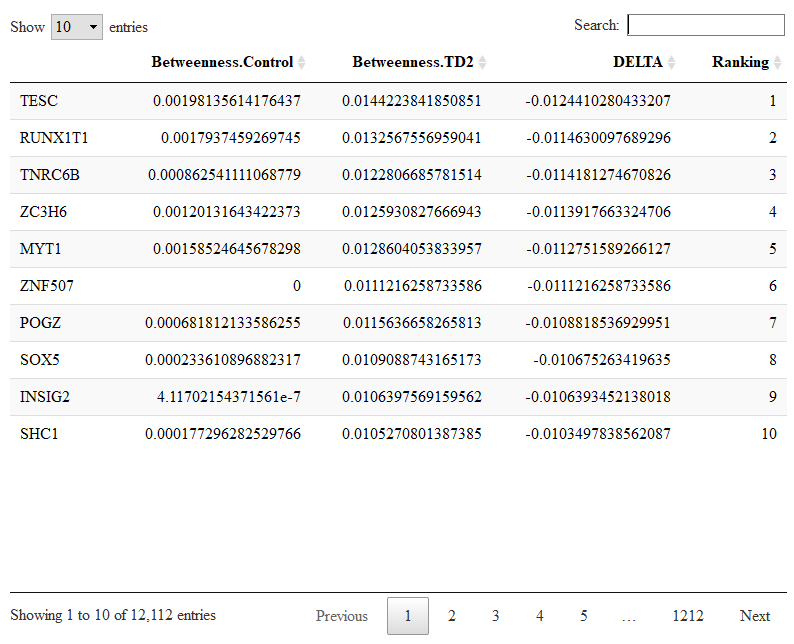


### Integration with DE
In our [paper](https://www.biorxiv.org/content/10.1101/446104v1) we show how to integrate node cenrality with differential expression (DE). The idea is simple. The genes with the highest centrality in the regulatory network are the most biologically important. Exploiting the known centrality, you can extract the DE genes with maximal biological relevance.

### Inversions of correlations 
Let's say that you are particularly interested in a specific gene. Aside from computing its centralities, you can also have a closer look to its correlations using the `$correlations` matrix in the output of `compute.network()` (check the help of the function). In this way you can check the correlations between your gene of interest and the rest of the trancriptome. If you have more than one network, you can compare how these correlations change. 

### Visualizing the networks 
I am not providing custom visualization tools. The networks are in `igraph` format, so you can use the igraph visualization tools.

### Tweaking the networks 
Networks are automatically generated by retaining only the most significant correlations. By default, the parameter `quantile.p=0.998` retains only the top 0.2% correlations. These selected correlations will become the edges of the raw network. We use a percentile selection instead of a fixed value selection (for example, correlations > 0.8 become edges) for reasons explained in our [paper](https://www.biorxiv.org/content/10.1101/446104v1).
Most of the times, selecting the top 0.2% correlations works fine. However, it could be that in some cases the overall distribution of correlations is pretty poor (meaning good correlations are rare) and that the top 0.2% includes correlations which are not good. When the top 0.2% percentile corresponds to a cutoff in the correlations which is lower than 0.7 the tool displays a warning and suggests to increase `quantile.p` or change some other settings.
Let's say we want to be more strict with the selection of the edges, we want to use 0.999 instead of 0.998 for `quantile.p` for the control network.

```{r}
results.ctl=compute.network(previous.output = results.ctl,quantile.p = 0.999)
```
Also, if you believe that your network is too dense (too many edges) or not dense enough (not enough edges), you can re-run the analysis increase or decreasing `quantile.p`, respectevely.

# bigSCale 2 iCells

iCells are the most peculiar and interesting feature of bigSCale2. With iCells, you can reduce large datasets of any size into smaller datasets of significantly higher quality. These datasets can be in turn analyzed with any tool, also those which do not natively support large cell numbers.<br />
Once you find a cluster in the iCell dataset, you can extract the relative cells directly in form of expression counts using `extract.cells()`.<br />
We now show to examples using the two different output format you can typically encounter: mtx and hdf5.<br />
If you have an expression matrix which is loaded in R workspace first write it to .mex file using the very simple `Matrix::writeMM()` and then proceed as I show next. 


# Example 1: 2 millions cells in .mtx format

As an example we now transform the dataset of 2 millions cells of the recent work: [The single-cell transcriptional landscape of mammalian organogenesis](https://www.nature.com/articles/s41586-019-0969-x).

At the moment the iCells works with either .mex files or .h5 files, which are the typical outputs of CellRanger. We download the 2M cells counts *gene_counts.txt* from [here](https://oncoscape.v3.sttrcancer.org/atlas.gs.washington.edu.mouse.rna/downloads). This file is in the .mex format.

We now create the iCells, setting to reduce to approximately 15K cells:

```{r}
out=iCells(file.dir = "gene_counts.txt",target.cells = 15000)
```

This will take some time (2M cells are a lot). So you can find the iCells [here](http://scg.cnag.cat/projects/bigscale/).
The output of `iCells()` includes the iCells expression counts, the indexes of the original cells for each iCell and other elements (see the the help of the function). 


# Example 2: 270K cells in .h5 format

We will now process the 384K cells of the Umbilical cord blood dataset from the [human cell atlas portal](https://preview.data.humancellatlas.org/). 
The final result of this tutorial, a dataset of approximately 8K high quality iCells from umbilical cord blood can be found [here](http://scg.cnag.cat/projects/bigscale/)
This example is different than the previous one in three ways: 1) the format of the input is .h5 instead of .mtx 2) the cell are unfiltered, so we have to filter the cells before running
`iCells()` 3) We will use the conditions (namely, the patient IDs of each cell) to instruct `iCells()` not to pool cells of different patients. **I do not reccomand doing this, normally**: I do not see any problem if an iCell contains cells of, say, two patients. It just means that this iCell represents a cell type present in more than one patient. However, If somebody really needs to keep some conditions disjoint at the iCell level he/she can do as follows.

Having an HDF5 format, first you have to convert it to .mex using `bigscale.convert.h5()`. I will remove the conversion step in the future, but for the moment ...
First we inspect the structure of the .h5 file to locate where the genome version  ( which tells as the field name in which data is stored).

```{r}
rhdf5::h5ls("ica_cord_blood_h5.h5")
```
```{r}
     group                    name       otype  dclass       dim
0        /                  GRCh38   H5I_GROUP                  
1  /GRCh38                barcodes H5I_DATASET  STRING    384000
2  /GRCh38                    data H5I_DATASET INTEGER 260473471
3  /GRCh38              gene_names H5I_DATASET  STRING     33694
4  /GRCh38                   genes H5I_DATASET  STRING     33694
5  /GRCh38                 indices H5I_DATASET INTEGER 260473471
6  /GRCh38                  indptr H5I_DATASET INTEGER    384001
7  /GRCh38                   shape H5I_DATASET INTEGER         2
8        / PYTABLES_FORMAT_VERSION   H5I_GROUP                  
9        /                 VERSION   H5I_GROUP                  
10       /             titldfdffde   H5I_GROUP                  
11       /                   title   H5I_GROUP                  
12       /                 version   H5I_GROUP   
```
The genome version is GRCh38.
Now we convert to .mtx format and, at the same time, we filter the cells. Here, I select the cells with at least 400 detected genes.

```{r}
out=bigscale.convert.h5(input.file = "ica_cord_blood_h5.h5",output.file= "ica_cord_blood.mtx.tar.gz",counts.field = "GRCh38",filter.cells = 400)
```

The output of the funtion contains the indices of the selected cells. Running `length(out$filtered.cells)` shows that we remained with 278367 cells. 
We now fetch the barcodes for these cells, which contain the patient IDs.

```{r}
barcodes=rhdf5::h5read(file = "ica_cord_blood_h5.h5",name = "GRCh38/barcodes")
barcodes[1]
```
```{r}
[1] "MantonCB1_HiSeq_1-AAACCTGAGGAGTTGC-1"
```
As explained in the cell atlas, the patient ID is the part "CB1" of this barcode. There are 8 patient IDs. With the next command, we create a factor variable containing the IDs and we next fetch those of the fltered cells.

```{r}
IDs=as.factor(apply(X = barcodes,MARGIN = 1,FUN = substr,start=7,stop=9))
IDs=IDs[out$filtered.cells]
```
We can finally create the iCells, here I decide that I want to reduce to approximately 8K iCells.

```{r}
out=iCells(file.dir = "ica_cord_blood.mtx.tar.gz",target.cells = 8000,sample.conditions = IDs)
```
out is a list containing all the necessary information, including the new expression counts and the mapping indeces of each iCell to the original cells. See the help of the function for more information. Gene names are not used for the iCell creation and can be recovered from the original file with `rhdf5::h5read(file = "ica_cord_blood_h5.h5",name = "GRCh38/gene_names")`. Below, a plot showing how the iCells, having an increased quality, improve the quality of result, as for example the segregation in the TSNE plot.


